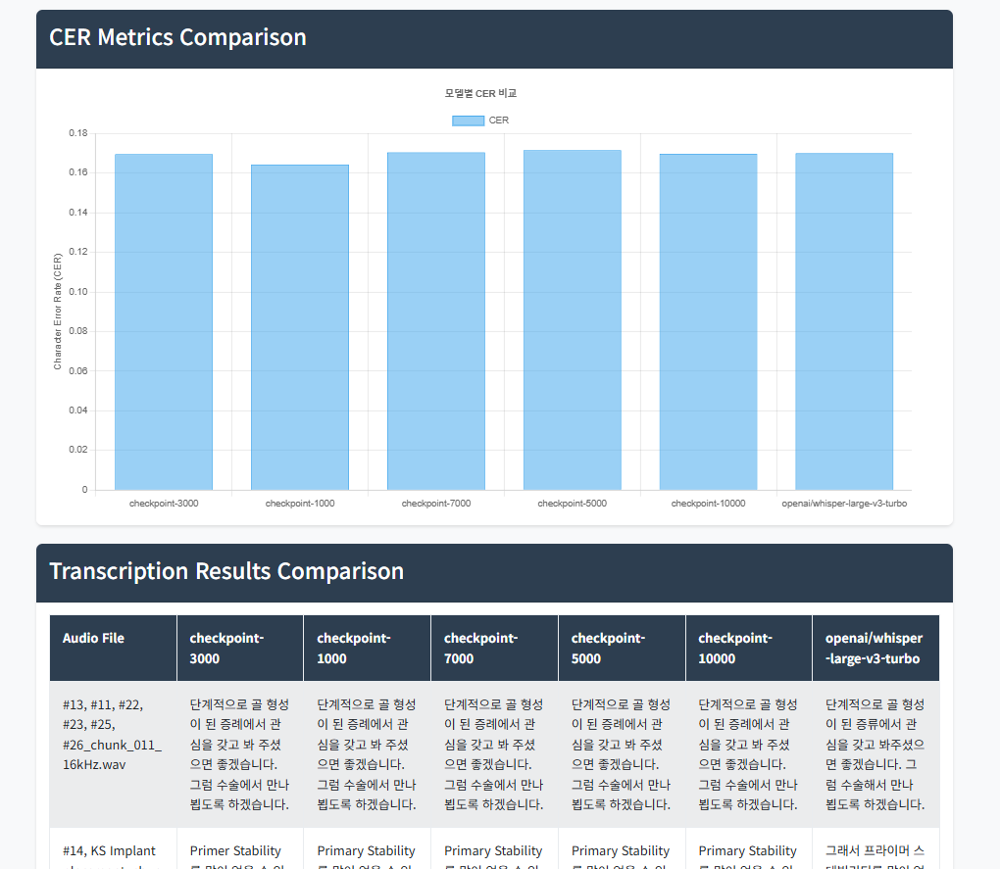

# Speech Recognition Evaluation System

A comprehensive web-based system for evaluating speech recognition model performance and managing speech datasets.

## Features

### Evaluation
- Upload and process evaluation JSON files containing transcription results
- Compare Character Error Rate (CER) metrics between different models
- Visualize performance metrics with interactive charts
- View detailed transcription results in a tabulated format
- Support for multiple model comparisons

### Dataset Management
- Manage and organize speech datasets
- View dataset statistics and information
- Process raw and processed audio files
- Track dataset versions and modifications

## Technical Stack

- **Backend**: FastAPI (Python)
- **Frontend**: Bootstrap 5, Chart.js
- **Database**: SQLite (for temporary data storage)
- **File Processing**: JSON, Audio file handling
- **Internationalization**: Multi-language support (English/Korean)

## Installation

1. Clone the repository:
```bash
git clone [repository-url]
cd speech-recognition-evaluation
```

2. Create and activate virtual environment (optional but recommended):
```bash
python -m venv venv
source venv/bin/activate  # Linux/Mac
# or
.\venv\Scripts\activate  # Windows
```

3. Install dependencies:
```bash
pip install -r requirements.txt
```

## Usage

1. Start the server:
```bash
uvicorn app.main:app --reload
```

2. Access the web interface:
```
http://localhost:8000
```

3. Navigate to the evaluation page:
```
http://localhost:8000/evaluation
```

4. Upload your evaluation JSON file with the following structure:
```json
{
  "transcriptions": {
    "model-name": [
      {
        "audio_filepath": "path/to/audio.wav",
        "pred_sentence": "predicted transcription"
      }
    ]
  },
  "CER metric": {
    "model-name": 0.123
  }
}
```
## Example Image




## Project Structure

```
app/
├── main.py              # FastAPI application entry point
├── config.py            # Configuration settings
├── models/             
│   ├── database.py      # Database models
│   └── evaluation.py    # Evaluation data models
├── routers/
│   ├── evaluation.py    # Evaluation routes
│   ├── dataset.py       # Dataset management routes
│   └── main_routes.py   # Main page routes
├── services/
│   └── evaluation_service.py  # Evaluation processing logic
├── templates/           # HTML templates
└── utils/
    └── i18n.py         # Internationalization support
```

## Features in Detail

### Evaluation System
- **Model Comparison**: Compare multiple speech recognition models side by side
- **Metric Visualization**: Interactive charts showing CER metrics
- **Detailed Results**: View complete transcription results in a searchable table
- **Error Analysis**: Identify and analyze transcription errors

### User Interface
- Clean and intuitive web interface
- Responsive design for various screen sizes
- Interactive data visualization
- Drag-and-drop file upload support

## Language Support

- English (Default)
- Korean (한국어)

Language can be switched using the selector in the navigation bar.

## Contributing

Contributions are welcome! Please feel free to submit a Pull Request.